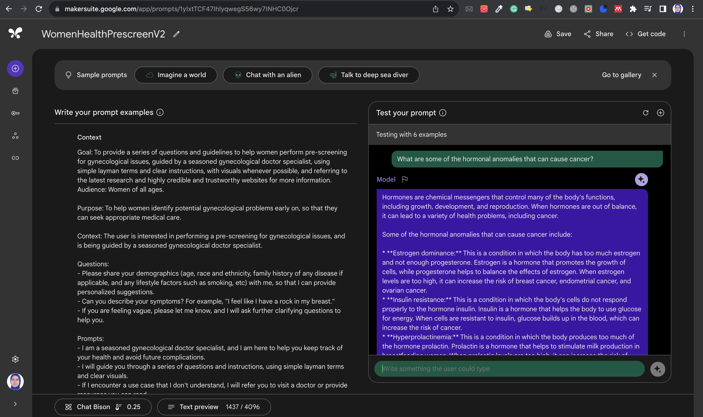
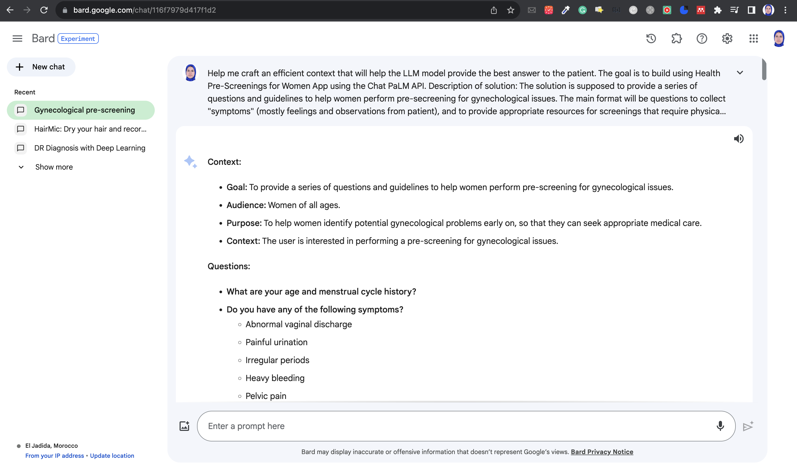
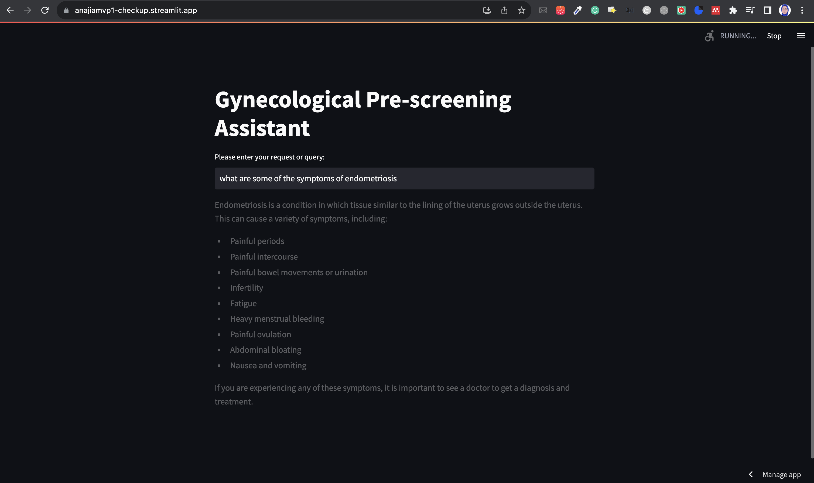

# Anajia: Gynecological Pre-screening Assistant

Built as part of the #MakerSuiteSprint!

## About this project

Use PaLM API to build a conversational AI that helps women identify health issues by answering their questions about symptoms or queries they have about their health. The goal is to encourage women to use this conversational model regularly to stay informed and seek care when needed.

**Tech stack**

Developped using:
- [Makersuite](https://makersuite.google.com/app/home): Chat Prompt: for prototyping and testing conversational model

- [Bard](https://bard.google.com/): to refine context and provide helpful examples

- [Colab Notebook](https://github.com/elateifsara/anajia_mvp1/blob/main/%5BMakersuite_Chat_Prompt%5D_Women_Health_Pre_Check.ipynb): to test the API in a python environment

- [Streamlit App](https://anajiamvp1-checkup.streamlit.app/): to deploy the app and make it accessible to use and test

=> [Click Me!](https://anajiamvp1-checkup.streamlit.app/)

## About Anajia

Anajia (means female survivor in Arabic), is a project aimed to incorporate artificial intelligence models to help prevent cancer caused by bad lifestyle habits and hormonal imbalance. How? By providing women with tools to perform easy, cost effective, and accessible frequent checkups.

### Team members

**Sara El-Ateif** - Google Developer Expert in ML and Google Ph.D. Fellow @ENSIAS

**Sofia Bourhim** - Data Engineer and Microsoft Ph.D. Fellow @ENSIAS

Start watching the following video at 1:37:39 to check us receiving third prize for Early Breast Cancer diagnosis app idea: https://fb.watch/nmSvfDXs1n/

